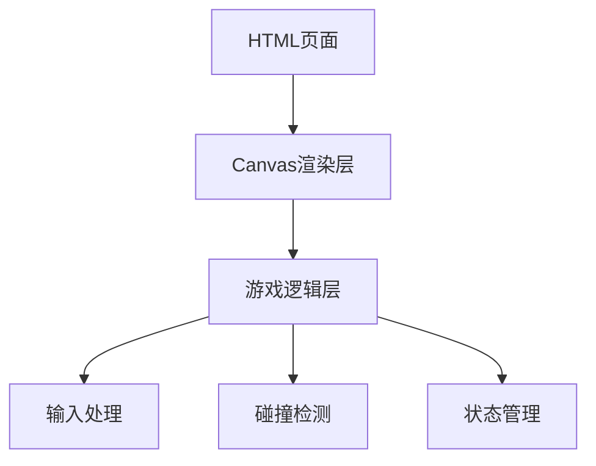

## 1. Architecture Design
这是一个纯前端游戏项目，使用Canvas进行渲染，没有后端和数据库。


## 2. Technology Description
- **Frontend**: 原生 HTML5 + CSS3 + JavaScript (ES6+)
- **渲染引擎**: Canvas 2D API
- **构建工具**: 无需构建工具，直接运行HTML文件
- **外部依赖**: 无

## 3. Route Definitions
不适用，单页面应用

## 4. API Definitions
不适用，无后端

## 5. Server Architecture Diagram
不适用，无后端

## 6. Data Model
不适用，无数据库

## 7. 核心代码结构
```
/workspace/
├── index.html          # 主页面
└── mecha-battle.js     # 游戏逻辑和渲染
```

## 8. 游戏对象设计
### 机甲类 (Mecha)
- 属性: x, y, width, height, hp, maxHp, speed, color, facing
- 方法: update(), draw(), attack(), defend(), takeDamage()

### 游戏状态
- 游戏阶段: 开始 → 进行中 → 结束
- 玩家输入状态: 按键映射
- 游戏循环: requestAnimationFrame
