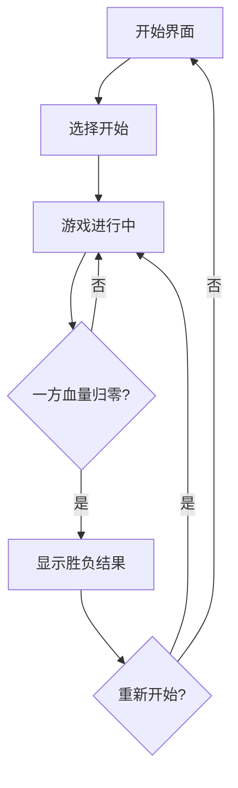

## 1. Product Overview
像素风机甲对战小游戏是一款经典的双人对战游戏，提供简单直观的操作体验，包含移动、攻击、防御等核心玩法。
- 目标用户：喜欢复古像素风格游戏的玩家，适合两人本地对战
- 市场价值：提供轻松有趣的休闲游戏体验，适合聚会或朋友间娱乐

## 2. Core Features

### 2.1 User Roles
| Role | Registration Method | Core Permissions |
|------|---------------------|------------------|
| 玩家1 | 无需注册 | 使用WASD键控制，Q键攻击，E键防御 |
| 玩家2 | 无需注册 | 使用方向键控制，J键攻击，K键防御 |

### 2.2 Feature Module
1. **游戏主界面**：像素风格游戏场景，两个机甲角色，血量显示，操作提示
2. **战斗系统**：移动、攻击、防御、血量计算、胜负判定
3. **游戏流程**：开始界面 → 游戏中 → 胜负结算 → 重新开始

### 2.3 Page Details
| Page Name | Module Name | Feature description |
|-----------|-------------|---------------------|
| 游戏主界面 | 游戏画布 | 800×600像素Canvas，绘制像素场景和机甲 |
| 游戏主界面 | 血量显示 | 顶部显示两位玩家的血量条和数值 |
| 游戏主界面 | 操作提示 | 底部显示控制键说明 |
| 胜负结算 | 结果弹窗 | 显示胜利者，提供重新开始选项 |

## 3. Core Process
游戏开始后，两位玩家各自控制自己的机甲在场景中移动，可以进行攻击和防御操作。当一方血量归零，游戏结束并显示胜利者。

## 4. User Interface Design
### 4.1 Design Style
- **主色调**：深蓝（#1a1a2e）作为背景，亮蓝（#0f3460）作为场景色，鲜红（#e94560）和亮绿（#4ecdc4）作为两位玩家的代表色
- **按钮风格**：复古像素风格，有边框和阴影，悬停时变色
- **字体**：使用像素风格的等宽字体，标题32px，正文16px
- **布局**：居中的游戏画布，上下显示信息面板
- **视觉元素**：像素化的机甲设计，简单的动画效果

### 4.2 Page Design Overview
| Page Name | Module Name | UI Elements |
|-----------|-------------|-------------|
| 游戏主界面 | 游戏画布 | 像素风格地面，天空背景，机甲角色 |
| 游戏主界面 | 血量条 | 两位玩家的彩色血量条，带数字显示 |
| 胜负结算 | 弹窗 | 大号胜利者文字，重新开始按钮 |

### 4.3 Responsiveness
- 桌面端优先，支持全屏显示
- 简单自适应，在不同屏幕尺寸下保持游戏比例

### 4.4 3D Scene Guidance
不适用
