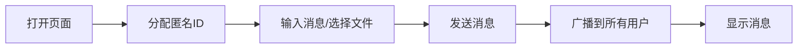

## 1. Product Overview
一个无需服务器的纯前端匿名聊天室应用，支持无限制文件上传和实时聊天功能。
- 主要功能：匿名聊天、无文件大小限制的文件上传、纯前端实现无需后端服务
- 目标价值：提供便捷、隐私、无服务器依赖的即时通讯体验

## 2. Core Features

### 2.1 User Roles
无需用户注册，所有用户均为匿名用户。

### 2.2 Feature Module
1. **聊天室首页**：消息显示区域、消息输入框、文件上传按钮、在线用户列表
2. **消息系统**：文本消息发送、文件消息发送、消息历史记录
3. **文件管理**：文件预览、文件下载、任意文件类型支持

### 2.3 Page Details
| Page Name | Module Name | Feature description |
|-----------|-------------|---------------------|
| 聊天室首页 | 消息显示区 | 实时显示聊天消息，区分文本和文件消息 |
| 聊天室首页 | 消息输入区 | 文本输入框、发送按钮、换行支持 |
| 聊天室首页 | 文件上传区 | 拖拽上传、点击选择、无文件大小限制 |
| 聊天室首页 | 用户列表 | 显示当前在线匿名用户数量和ID |

## 3. Core Process
用户打开页面 → 系统分配匿名ID → 用户输入消息或选择文件 → 点击发送 → 消息广播到所有在线用户 → 其他用户收到并显示消息

## 4. User Interface Design
### 4.1 Design Style
- 主色调：深邃紫黑渐变背景，蓝绿色系渐变作为主色
- 按钮风格：圆润圆角、悬停动画效果、微妙阴影
- 字体：使用现代无衬线字体，建立清晰的层次结构
- 布局样式：卡片式设计，半透明玻璃质感
- 图标风格：使用简约的线性图标

### 4.2 Page Design Overview
| Page Name | Module Name | UI Elements |
|-----------|-------------|-------------|
| 聊天室首页 | 消息显示区 | 半透明卡片、区分发送者的消息气泡、时间戳、流畅动画 |
| 聊天室首页 | 输入区域 | 渐变边框、文件拖拽区域、发送按钮、响应式布局 |
| 聊天室首页 | 用户列表 | 侧边栏、用户头像、在线状态指示 |

### 4.3 Responsiveness
桌面优先设计，完全响应式适配平板和移动设备，触摸优化。

### 4.4 文件处理
- 文件通过Base64编码直接嵌入消息中
- 支持图片、视频、文档等任意文件格式
- 提供文件预览和下载功能
